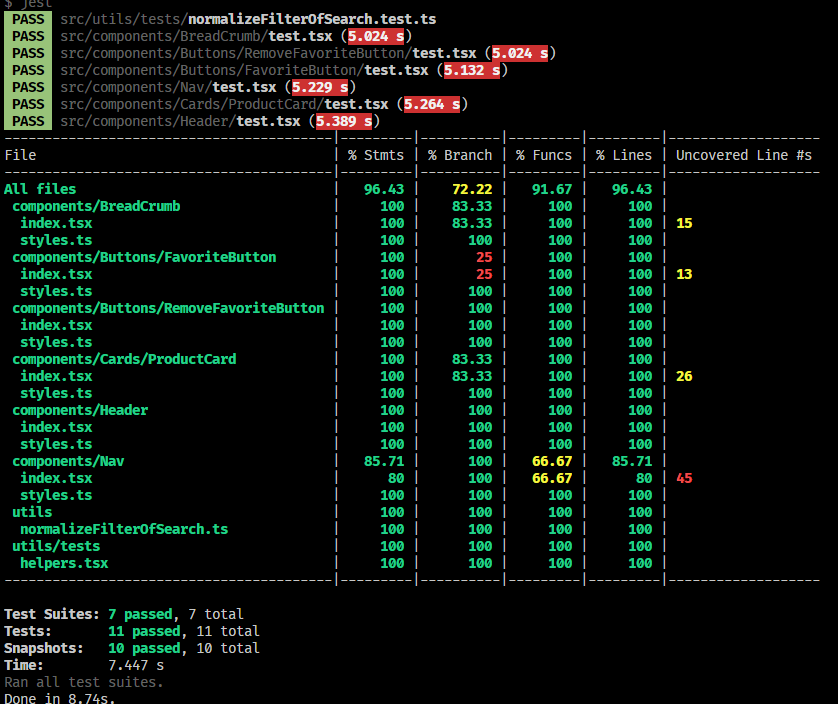

<div>
  

  
</div>


<h1 align="center">WishList</h1>

<p align="center">
  Uma aplicação Web responsiva desenvolvida com <a href="https://nextjs.org/">create-next-app</a> que consulte a API disponibilizada pela empresa empresa <a href="https://github.com/luizalabs">Luiza Labs</a> onde exibe uma lista de produtos e podemos favoritar cada um deles.
</p>

<p align="center">
 <a href="#features">Features</a> •
 <a href="#-tecnologias">Tecnologias</a> •
 <a href="#arquitetura">Arquitetura</a> •
 <a href="#testes">Testes</a> •
 <a href="#como-usar">Como usar</a> •
 <a href="#desafios">Desafios</a> •
 <a href="#melhorias">Melhorias</a> •
</p>

<h4 align="center">
	 Status: Entregue!
</h4>

### Features

- [x] Criar 2 tela (listagem dos produtos / listagem de favoritos/wishlist);
- [x] Listar os produtos;
- [x] Buscar por um ou mais produtos ou favoritos;
- [x] Na home, poder favoritar os produtos adicionando-os na wishlist/favoritos;
- [x] Na wishlist, poder remover os produtos da wishlist.favoritos;
- [x] A qualquer momento o cliente pode visualizar sua Wishlist completa, com todos os produtos que ele selecionou em uma única tela;
- [x] Salvar os produtos em localStorage para que possa ser visualizado a qualquer momento pelo usuário.

#### Outros

- [x] Testes em todos componentes e nas principais funções do projeto.
- [x] Storybook em todos componentes para visualização e testes de forma isolada.
- [x] Adicionado botão de voltar caso o usuário não esteja na Home.
- [x] Adicionado react toastify para notificar o usuário da remoção do produto da wishlist.
- [x] Adicionado texto e link caso nao exista nenhum produto na wishlist/favoritos.
- [x] Adicionado um span em vermelho e branco para mostrar a quantidade de produtos adicionados na wishlist/favoritos.

### Tecnologias

As seguintes ferramentas foram usadas na construção do projeto:

- [Next.js](https://nextjs.org/)
- [React](https://pt-br.reactjs.org/)
- [TypeScript](https://www.typescriptlang.org/)


#### Auxiliares

- [Jest](https://jestjs.io/)
- [storybook](https://storybook.js.org/)
- [Axios](https://github.com/axios/axios)
- [Styled Components](https://styled-components.com/)
- [React Toastify](https://www.npmjs.com/package/react-toastify)

#### Padronização de código:

- [ESLint](https://eslint.org/)
- [Prettier](https://prettier.io/)

### Arquitetura

```shell
src/
|-- public/images/ # Contém todas as imagens estáticas do projeto.
|-- components/ # Contém os components reutilizáveis do projeto.
|-- hooks/ # Contém todos os contextos para manipulação de estados globais com useContext
|-- pages/ # Todas as páginas/roteamento do projeto estão dentro dessa pasta.
|-- services/ # Arquivos de configurações de requisições a API.
|-- styles/ # Contém todos os arquivos relacionados a padronização de estilos do projeto.
|-- types/ # Contém todas as tipagens do projeto.
|-- utils/ # funções globais, que podem ser reutilizadas.
```
---

### Como usar
#### Pré-requisitos

Antes de começar, você vai precisar ter instalado em sua máquina as seguintes ferramentas:
[Git](https://git-scm.com), [Node.js](https://nodejs.org/en/), [yarn](https://yarnpkg.com/) ou [npm](https://www.npmjs.com/package/npm).

Além disto é bom ter um editor para trabalhar com o código como [VSCode](https://code.visualstudio.com/)

##### Clone este repositório
```bash
git clone https://github.com/fernando-meira/goomer-frontend-challenge.git
```
##### Acesse a pasta do projeto no terminal/cmd
```bash
cd goomer-frontend-challenge
```
##### Instale as dependências com yarn ou npm
```bash
yarn
# ou npm install
```
##### Execute a aplicação em modo de desenvolvimento
```bash
yarn start
```
#### O servidor inciará na porta :3000 - acesse <http://localhost:3000>

---

### Testes



##### Execute o comando a seguir para rodar os testes unitários
```bash
yarn test
```
___


### Desafios
<p> A Feature mais complexa, foi a manipulação dos produtos para salvar na wishlist/favoritos e guardar em localStorage. Utilizei <a href="https://pt-br.reactjs.org/">Context API</a> Onde possuo domínio. Geralmente uso cookie para gravar os dados, ma confesso que foi muito melhor utilizar localStorage.

Outro ponto foram os testes unitários e storybook, até esse projeto eu não tinha tido contato, conhecia apenas de forma teórica, apesar de não implementar os testes nos hooks consegui em todos componentes e nas principais funções.
</p>

---

### Melhorias
<p> Como havia apenas um input, manipulei de forma pura, mas o legal seria implementar um <a href="https://react-hook-form.com/">react-hook-form</a> para evitar possíveis re-render caso o wishlist tomasse larga escala.

Outro ponto a ser revisto é o tratamento de erros, fiz alguns com react toastify, porém no design fica muito vazio caso não ache nada na pesquisa, por exemplo.

Na api, possuí muito mais informações do produto, então poderia ser criado mais uma tela onde exibe todos os dados do produto, ou algum modal. Acredito que seria muito melhor uma page pois poderíamos receber o [slug] e iniciar uma manipulação de SEO, que inclusive recomendo <a href="https://www.npmjs.com/package/next-seo">Next SEO</a></p>

---

<p>Criado com as melhores práticas e tecnologias que conheço no momento e, sinceramente, farei desse "conheço no momento" meu eterno aprendizado!</p>

<strong><a href="https://jhonatanlima.com.br/">Jhonatan Lima</a></strong>


<p>Agradeço a <a href="https://github.com/luizalabs">Luiza Labs</a> pela oportunidade!</p>

